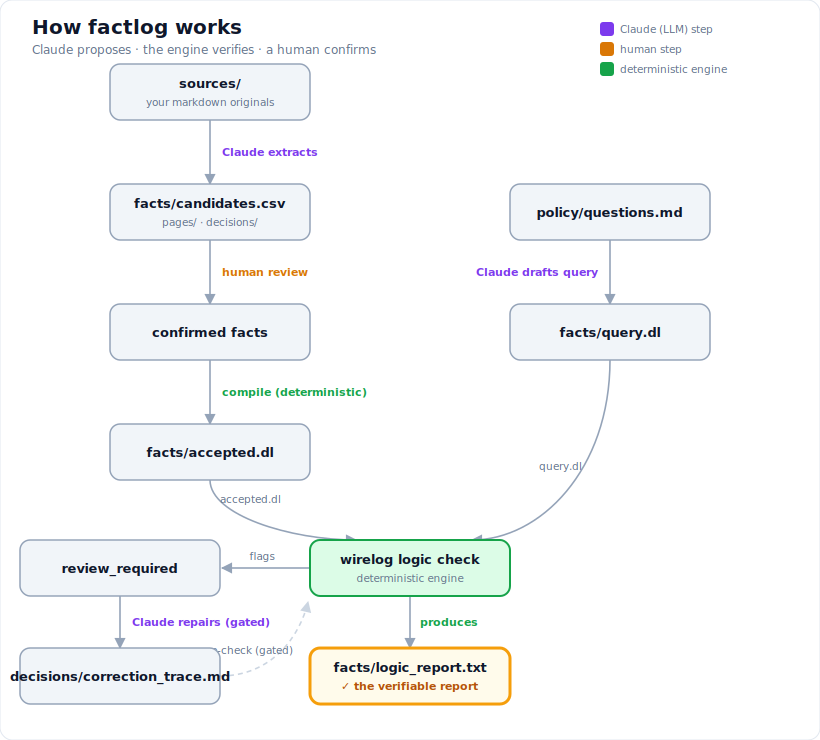

# Concepts — what factlog is and how it works

> 🌐 **English** | [한국어](concepts.md)

## Overview

factlog creates a **per-project knowledge base (KB) folder** and keeps the claims
extracted from the documents inside it as verifiable, source-backed facts. It is
not for one kind of wiki only — you can create a KB folder wherever you have
documents worth a human review.

- Reports / proposals
- Slides (PPT)
- Papers / research notes
- Code documentation / design documents
- Dataset descriptions / data dictionaries
- Personal and team project notes
- A wiki you already run

The core flow fits in one line.

```text
documents -> candidate facts -> human review -> accepted facts -> engine-verified answers
```

> If you are new, start with the
> [quick-start tutorial](../../examples/sample-kb/README.md) (Korean only), which
> walks the whole flow through once without your own data.

This tool follows one rule.

> The agent does not draw conclusions. The agent produces files and calls a CLI.
> The CLI returns a verifiable report.

- **The LLM (Claude, in-session) extracts** — it pulls candidate facts from the
  KB folder's `sources/`, drafts Datalog queries from natural-language questions,
  and attempts limited self-correction.
- **A deterministic engine (wirelog, built on
  [pyrewire](https://github.com/semantic-reasoning/PyreWire)) verifies** — it
  compiles confirmed facts, runs the logic check, and surfaces policy findings,
  conflicts, and `review_required` items.

## KB folder layout — where do my files go

`/factlog setup` (or `factlog init`) creates **one KB folder**. The default
location is `~/wiki` under your home directory (`~` is the home directory —
macOS `/Users/<name>`, Windows `C:\Users\<name>`), and `--target <path>` lets you
choose where it goes (e.g. `/factlog setup --target ~/my-report`). setup
**prints the absolute path** of the KB it created in its summary, so you can open
that path in File Explorer (Windows) or Finder (macOS).

```text
<KB>/                     ← the folder setup created (default ~/wiki)
├── sources/              ← put your documents here (reports, papers, notes, wiki, …)
├── facts/                ← (engine output) candidates.csv · accepted.dl · logic_report.txt
├── policy/               ← (optional) review questions and policy rules
├── runs/                 ← (engine output) extraction run records, binary conversions (runs/sources/)
├── pages/ · decisions/   ← (engine output) not hand-edited
└── templates/
```

> **The key point:** the only thing you put in yourself is the documents under
> `<KB>/sources/`. factlog fills and manages the rest of the folders. Binaries
> like `.docx` and `.pdf` can go in `sources/` too — `/factlog sync` converts
> them to text automatically (→ `runs/sources/`).

### The first pass — where my files go, and what factlog creates

Right after `/factlog setup` the KB is **nearly empty.** All setup creates is the
folders above, a few config files under `policy/`, and `templates/pages.md`.
`facts/` starts out as an **empty folder** — no `candidates.csv`, no `accepted.dl`
yet.

```text
<KB>/
├── sources/                              ← empty. This is where you start
├── facts/                                ← empty (no facts yet)
├── policy/
│   ├── questions.md                      ← review questions (editable)
│   ├── logic-policy.md                   ← policy rules (editable)
│   ├── attribute-relations.md            ← literal-value relation declarations (editable)
│   ├── typed-relations.md                ← comparable-literal relation declarations (editable)
│   ├── sync-ignore.md                    ← glob patterns to exclude from sync (editable)
│   └── prompts/                          ← the 4 extraction/query prompts
├── pages/ · decisions/                   ← empty
├── runs/sources/                         ← empty (where conversions will land)
└── templates/pages.md
```

Now put the documents you want verified into `sources/`. Subfolders are fine.

```text
<KB>/sources/
├── 2026-q1-report.docx      ← a file I added
├── notes.md                 ← a file I added
└── research/
    └── paper.pdf            ← a file I added (subfolders are recognized as-is)
```

One run of `/factlog sync` and factlog fills in the rest. **`sources/` stays as it
was** — not even conversions are written there.

```text
<KB>/
├── sources/                             ← untouched. My originals, as they were
├── runs/
│   ├── sources/
│   │   ├── 2026-q1-report.docx.md       ← (generated) the conversion. Original's full name + .md
│   │   └── research/paper.pdf.txt       ← (generated) mirrors the subdirectory structure
│   └── <extraction run records>.json    ← (generated) where a fact's value lives
├── facts/
│   ├── candidates.csv                   ← (generated) candidate facts — the review targets
│   └── accepted.dl                      ← (generated) confirmed facts only. Engine input
└── pages/ · decisions/                  ← (generated) not hand-edited
```

To summarize:

| Path | Who writes it | Can I edit it |
|------|---------------|---------------|
| `sources/` | **you** | Yes — this is your space |
| `policy/` | setup scaffolds it, then **you** | Yes — questions, policy, relation declarations |
| `runs/sources/` | factlog (`ingest`) | No — the next sync recreates them |
| `runs/*.json` | factlog (extraction) | No — use `factlog amend` |
| `facts/candidates.csv` | factlog (merge) | Use `accept`/`reject`/`amend` rather than editing directly |
| `facts/accepted.dl` | factlog (compile) | No — it is generated from `candidates.csv` |
| `pages/`, `decisions/` | factlog | No |

That `runs/*.json` is where a fact's value lives matters. merge rebuilds
`candidates.csv` from it every time, so hand-edits to `candidates.csv` are
overwritten and lost on the next `/factlog sync`. That is why correcting a value
goes through [`factlog amend`](../reference/review.en.md#reviewing-facts-factlog-review--accept--reject),
which updates both sides together.

## candidate vs accepted — the trust boundary

factlog has two kinds of facts.

- **candidate** — only a *claim* extracted from a document. `sync` produces
  candidates; it does **not** by itself produce facts you can trust.
- **accepted** — a fact a human reviewed and accepted. **Only accepted facts are
  engine input**, and only they back the answers to your questions.

This human review step is factlog's **trust boundary**. Anything the model
produces is only a candidate until a human confirms it as accepted.

## Commands at a glance — slash command · CLI command · KB file

factlog's commands split into two layers by **where you run them**. The third
row is not a command but the **KB files** (outputs/locations) those commands
read and write.

| Category | Where it runs | Examples | Role |
|------|-----------|------|------|
| **Claude Code slash command** | Inside a Claude Code session | `/factlog setup`, `/factlog sync`, `/factlog query`, `/factlog check`, `/factlog ask` | The agent reads sources to extract candidate facts, drafts a query from a natural-language question, and invokes the engine verification flow (compile, logic check, answer) — the verification itself is performed by the deterministic engine. |
| **Python CLI command** | Terminal (shell) | `factlog status`, `factlog review`, `factlog accept`, `factlog reject`, `factlog amend` | Check KB status, and let **a human** review, accept, retire, or correct candidate facts. `accept`/`reject` are the **human gate** that confirms a candidate as accepted or retires it (not an automated step). |
| **KB file** (not a command — output/location) | The project KB folder | `sources/`, `facts/candidates.csv`, `facts/accepted.dl`, `facts/logic_report.txt` | Where the originals (`sources/`), the candidates (`candidates.csv`), and the engine input (`accepted.dl`) live. `facts/logic_report.txt` is **where the engine-generated verification result is recorded**; it is not hand-edited. |

This table meshes with the [trust boundary](#candidate-vs-accepted--the-trust-boundary)
above. A slash command (`/factlog sync`) only produces **candidates**;
confirmation as accepted goes through the CLI gate a human runs in the terminal
(`factlog accept` / `factlog reject` / `factlog amend --accept`). Only an
`accepted.dl` confirmed that way becomes engine input.

## How it works



<details>
<summary>Text version</summary>

```
sources/        →  Claude extracts        →  facts/candidates.csv, pages/, decisions/
candidates       →  human review           →  confirmed facts
confirmed        →  compile (deterministic) →  facts/accepted.dl
questions        →  Claude drafts query     →  facts/query.dl
accepted + query →  wirelog logic check     →  facts/logic_report.txt   ← the verifiable report
review_required  →  Claude repairs (gated)  →  decisions/correction_trace.md
```

</details>
